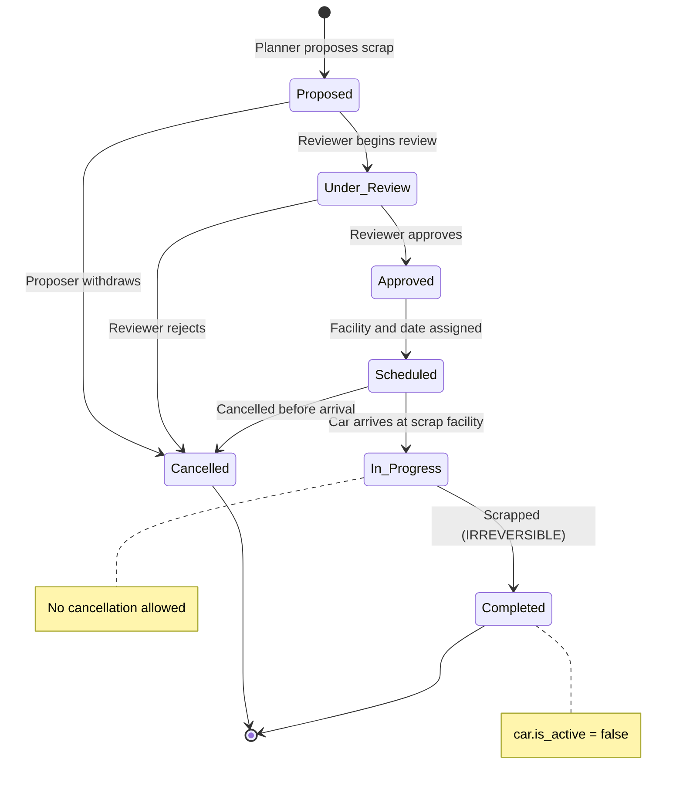
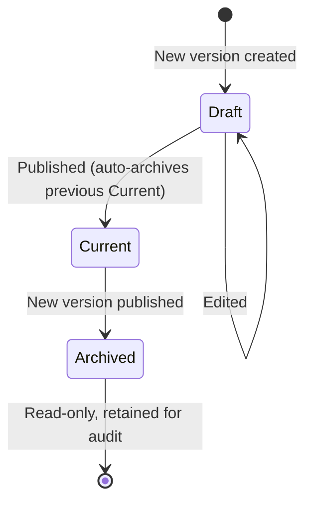
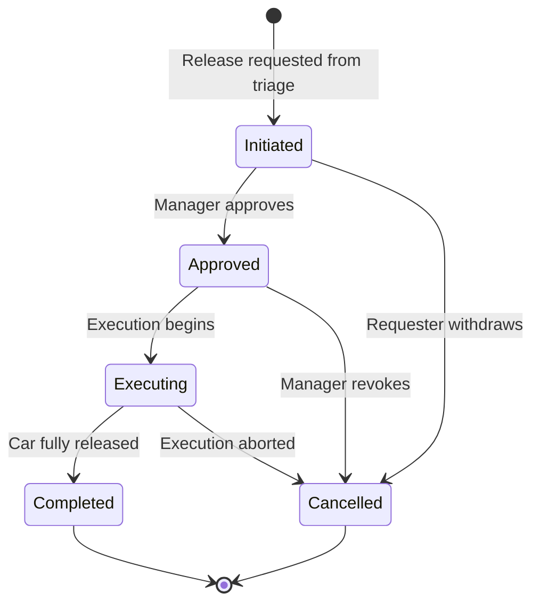
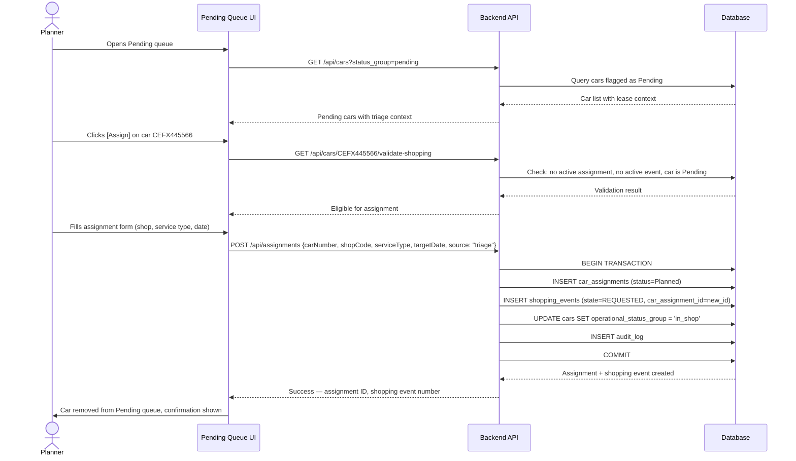
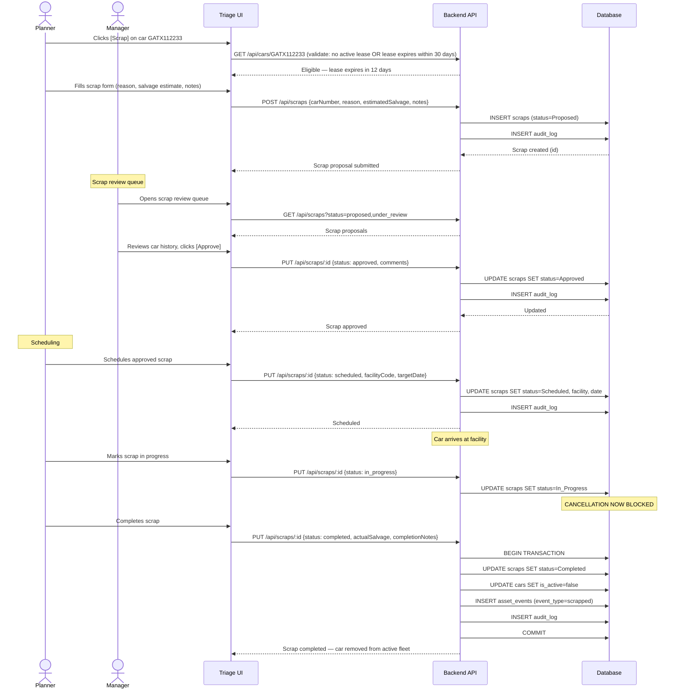
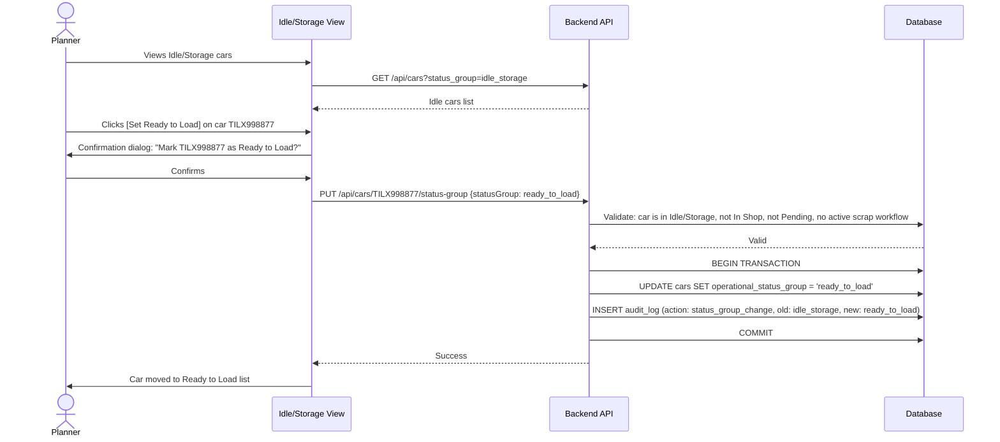
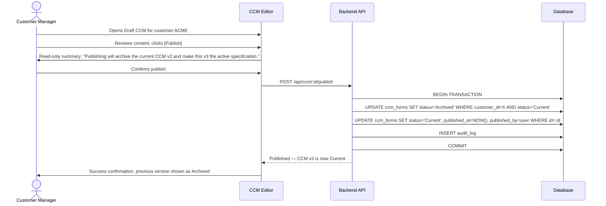
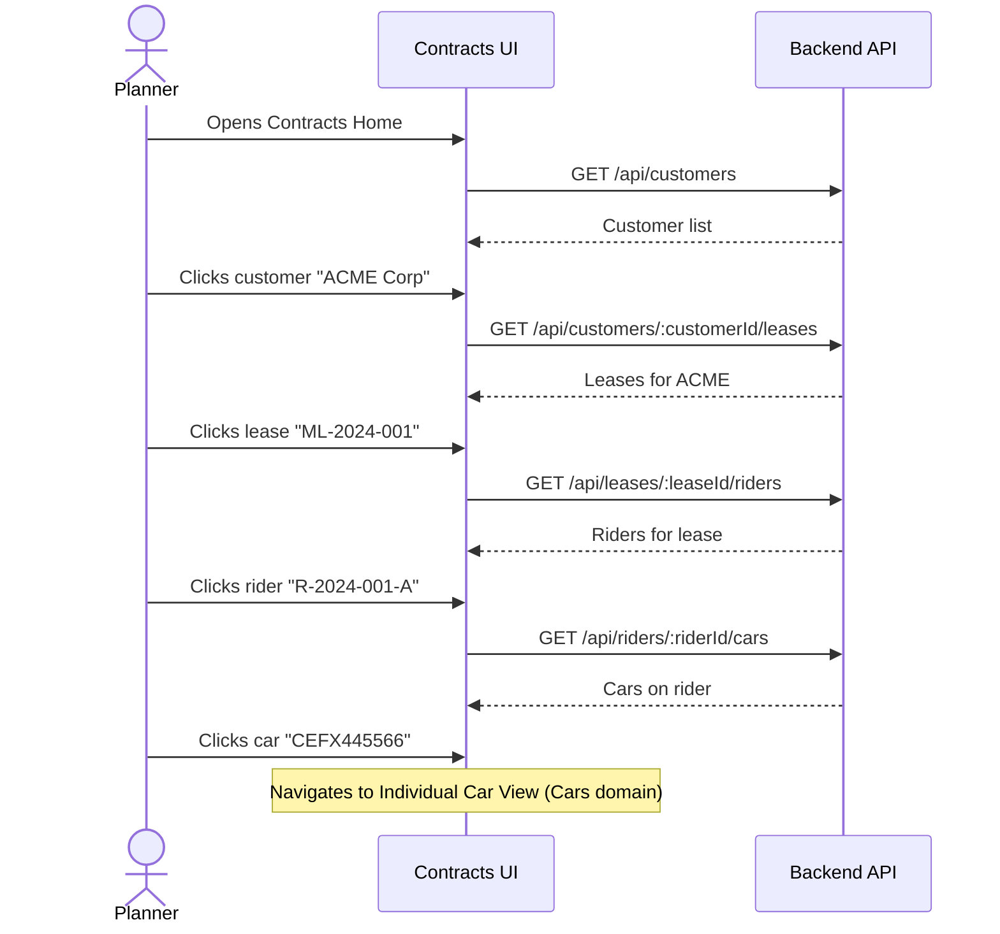
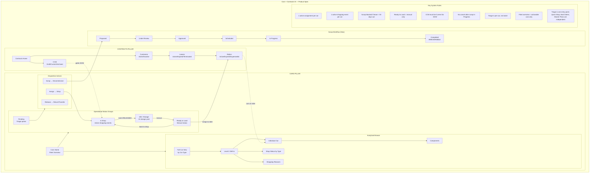

# Cars + Contracts Information Architecture — Developer Specification

**Status**: Draft v2 — Review Corrections Applied
**Scope**: Cars domain + Contracts domain (2 of 4 pillars)
**Date**: 2026-02-10

### Scope Boundary

The **Fleet Overview** (Cars Home) shows only cars that need management action — cars between assignments, in shop, in storage, or awaiting disposition. Cars on active leases at customer sites are **not in scope** for this view. They are managed through the Contracts pillar (Rider → Cars on Rider).

This means the status group counts on Cars Home will **not** sum to total fleet size. They represent the actionable subset of the fleet.

---

## 1. User Stories with Acceptance Criteria

### Contracts Domain

#### US-C1: View Customer List
**As a** planner, **I want to** see all customers from Contracts Home, **so that** I can drill into their lease structures.

**Acceptance Criteria:**
- Contracts Home displays a navigable list of customers
- Each customer row shows: customer code, name, active lease count, active car count
- Clicking a customer navigates to Customer Detail (Leases view)
- List supports search by customer code or name
- Inactive customers are hidden by default, toggleable

#### US-C2: Drill Customer → Leases → Riders
**As a** planner, **I want to** navigate from a customer to their leases, then from a lease to its riders, **so that** I can understand the full contract structure for a customer.

**Acceptance Criteria:**
- Customer Detail shows all master leases for that customer
- Each lease row shows: lease ID, start/end date, status (Active/Expired/Terminated), rider count, car count
- Clicking a lease shows its riders
- Each rider row shows: rider ID, effective/expiration dates, status, car count, rate per car
- Clicking a rider shows cars assigned to that rider
- Breadcrumb navigation: Contracts Home > Customer > Lease > Rider

#### US-C3: View and Manage CCM from Contracts
**As a** customer manager, **I want to** access a customer's CCM directly from the Contracts area, **so that** care specifications are in context with the contract data.

**Acceptance Criteria:**
- Contracts Home has a direct path to CCM (alongside Customers)
- CCM view shows all customer care manuals, filterable by customer
- Each CCM entry shows: customer, version, status (Draft/Current/Archived), last updated
- Clicking a CCM opens the full care manual detail
- Only one CCM per customer can be in `Current` status at a time

#### US-C4: CCM Version Lifecycle
**As a** customer manager, **I want to** draft, publish, and archive CCM versions, **so that** care specs are versioned and auditable.

**Acceptance Criteria:**
- User can create a new CCM version (starts as Draft)
- User can edit a Draft CCM
- User can publish a Draft CCM → status becomes `Current`
- Publishing auto-archives the previous `Current` version
- Archived versions are read-only and retained for audit
- CCM version history is visible with who published and when
- System blocks SOW generation if customer has no `Current` CCM

---

### Cars Domain — Status Groups

#### US-F1: Fleet Overview with Status Group Navigation
**As a** planner, **I want to** see the fleet organized by operational status groups (In Shop, Idle/Storage, Ready to Load, Pending), **so that** I can quickly understand fleet disposition and act on cars that need attention.

**Acceptance Criteria:**
- Cars Home shows summary counts for each status group
- Each group is clickable, navigating to a filtered list of cars in that group
- Counts update in real-time (or on refresh)
- Status groups are: In Shop, Idle / Storage, Ready to Load, Pending
- Total car count shown alongside group breakdown

#### US-F2: View In Shop Cars
**As a** planner, **I want to** see all cars currently in shop, **so that** I can monitor active shopping events.

**Acceptance Criteria:**
- Displays cars with active shopping events (state REQUESTED through READY_FOR_RELEASE)
- Each row shows: car number, car type, shop code, shopping event state, days in shop, shopping type
- Filterable by sub-status (Arrived, Enroute, Overdue, Service Due)
- Clicking a car navigates to Individual Car view
- Clicking the shopping event navigates to shopping event detail

#### US-F3: View Idle / Storage Cars
**As a** planner, **I want to** see all cars in idle/storage status, **so that** I can identify cars available for future assignment.

**Acceptance Criteria:**
- Displays cars at storage yards (Y-prefix shops) with no active shopping event and not in Pending
- Each row shows: car number, car type, location, days in storage, last shop date, qualification status
- Sortable by days in storage (longest first)
- Cars with overdue qualifications flagged visually

#### US-F4: View Ready to Load Cars
**As a** planner, **I want to** see all cars marked as Ready to Load, **so that** I can assign them to customers.

**Acceptance Criteria:**
- Displays cars with status = Ready to Load
- Each row shows: car number, car type, location, date marked ready, qualification summary
- List serves as the primary source for customer assignment decisions

#### US-F5: Set Ready to Load Status
**As a** planner, **I want to** manually mark an Idle/Storage car as Ready to Load, **so that** it enters the pool of cars available for customer assignment.

**Acceptance Criteria:**
- Action available only on cars in Idle/Storage status group
- Action is blocked if car is In Shop or Pending
- User must confirm the status change (single confirmation)
- Status change is recorded in audit log (who, when)
- Car moves from Idle/Storage list to Ready to Load list immediately

#### US-F6: View Pending Cars (Triage Queue)
**As a** planner, **I want to** see all cars in Pending status, **so that** I can triage them for disposition.

**Acceptance Criteria:**
- Displays cars flagged as Pending (lease expiring, awaiting disposition decision)
- Each row shows: car number, car type, current customer, lease/rider info, expiration date, reason for pending
- Sorted by urgency (nearest lease expiry first)
- Cars with open bad orders highlighted
- Cars with overdue qualifications flagged
- Each car has action buttons: [Assign] [Release] [Scrap]
- Note: Cars from recently assigned leases that need prep shopping bypass triage and go directly to assignment (see US-F10)

#### US-F7: Triage Pending Car → Assignment
**As a** planner, **I want to** triage a Pending car into an assignment, **so that** the car enters the shopping workflow.

**Acceptance Criteria:**
- From Pending queue, clicking [Assign] opens assignment creation
- Assignment form requires: shop, service type, target date
- System validates: no existing active assignment, car is in Pending status
- On creation, car moves from Pending to In Shop group (once shopping event begins)
- Assignment creation is audited

#### US-F8: Triage Pending Car → Release
**As a** planner, **I want to** triage a Pending car into a release, **so that** the car is returned or transferred.

**Acceptance Criteria:**
- From Pending queue, clicking [Release] opens release initiation
- Release form requires: release type (lease_expiry, voluntary_return, contract_transfer, disposition), reason
- Release starts in `Initiated` state, requires approval before execution
- On release completion, car moves to Idle/Storage
- Release initiation is audited

#### US-F9: Triage Pending Car → Scrap
**As a** planner, **I want to** triage a Pending car for scrap, **so that** the car enters the scrap approval workflow.

**Acceptance Criteria:**
- From Pending queue, clicking [Scrap] opens scrap proposal form
- Scrap form requires: reason, estimated salvage value, supporting notes
- System validates: no active lease on car (must be released first) OR lease expires within 30 days; car is in Pending status
- Scrap starts in `Proposed` state
- Proposal is audited
- Warning displayed: "Scrap is irreversible once in progress"

#### US-F10: Direct Assignment for New Lease Prep
**As a** planner, **I want to** assign cars that need prep shopping for a recently assigned lease directly to a shop, **so that** I don't waste time triaging cars whose disposition is already decided.

**Acceptance Criteria:**
- When a new lease/rider is assigned and cars need prep shopping, planner can create assignments directly
- This flow bypasses the Pending triage queue — the disposition decision (Assignment) is already known
- Assignment creation uses the same form as triage-based assignment (shop, service type, target date)
- Car moves directly to In Shop once shopping event begins
- System records the source as "lease_prep" to distinguish from triage-originated assignments

#### US-F11: Exit Ready to Load
**As a** planner, **I want to** assign a Ready to Load car to a customer or send it back to shop, **so that** the car re-enters active service or gets additional work.

**Acceptance Criteria:**
- From Ready to Load list, planner can:
  - **Assign to customer**: Add car to a rider (car exits fleet overview, now managed via Contracts)
  - **Send back to shop**: Create new assignment (car moves to In Shop)
- Assigning to a rider automatically clears `ready_to_load` status
- Creating a new assignment moves status to `in_shop`
- Both actions are audited

#### US-F12: Revert Ready to Load
**As a** planner, **I want to** revert a Ready to Load car back to Idle/Storage, **so that** I can correct a premature status change.

**Acceptance Criteria:**
- Action available on any Ready to Load car
- User must confirm the revert
- Car moves back to Idle/Storage list
- Revert is recorded in audit log

---

### Cars Domain — Full Car View (Analytical)

#### US-V1: Full Car View by Car Type
**As a** planner, **I want to** browse the full fleet organized by car type, **so that** I can analyze fleet composition.

**Acceptance Criteria:**
- View shows all car types with counts: Tank, Hopper, Gondola, Boxcar, Flatcar
- Each car type row shows: type name, total count, in-shop count, idle count, ready count, pending count
- Clicking a car type navigates to Level 2 Drill-In for that type

#### US-V2: Level 2 Drill-In
**As a** planner, **I want to** drill into a car type and see detailed breakdowns, **so that** I can analyze sub-populations.

**Acceptance Criteria:**
- Shows all cars of the selected type
- Provides three sub-views:
  - **Car List**: Individual cars with key attributes
  - **Shop Status by Type**: Distribution of shopping event states for this car type
  - **Shopping Reasons**: Breakdown of shopping reasons for cars of this type currently in shop
- Each sub-view is a tab or navigation option within the drill-in

#### US-V3: Individual Car View
**As a** planner, **I want to** see all information about a single car, **so that** I can make informed decisions.

**Acceptance Criteria:**
- Shows: car number, car type, current status group, current location
- Sections for:
  - **Contract context**: Current customer, lease, rider (linked)
  - **Components**: All components with status (links to US-V4)
  - **Qualifications**: Current qualification status, next due dates
  - **Assignment history**: Past and current assignments
  - **Shopping history**: Past and current shopping events
  - **Audit trail**: Recent status changes
- Actions available based on current status (e.g., [Set Ready to Load] if Idle)

#### US-V4: Car Components View
**As a** planner, **I want to** see all components on a car, **so that** I can understand its physical configuration.

**Acceptance Criteria:**
- Lists all components for the selected car
- Each component shows: type, serial number, manufacturer, install date, last inspection, next due, status
- Failed/removed components visually distinguished
- Component history accessible per component

---

### Scrap Workflow (New Entity)

#### US-S1: Scrap Proposal Review
**As a** manager, **I want to** review scrap proposals, **so that** I can approve or reject scrap decisions.

**Acceptance Criteria:**
- Review queue shows all scraps in `Proposed` or `Under Review` status
- Each proposal shows: car number, car type, reason, estimated salvage value, proposer, date proposed
- Reviewer can see car history (assignments, shopping events, qualification status, condition)
- Reviewer sets status to `Under Review` when starting review
- Reviewer can [Approve] or [Reject] with required comments

#### US-S2: Scrap Approval and Scheduling
**As a** manager, **I want to** approve a scrap and schedule it, **so that** the car proceeds to a scrap facility.

**Acceptance Criteria:**
- Only `Approved` scraps can be scheduled
- Scheduling requires: scrap facility (Z-prefix shop), target date
- Scheduled scrap is visible in fleet planning views
- Car remains in fleet inventory until scrap is `Completed`

#### US-S3: Scrap Completion
**As a** coordinator, **I want to** mark a scrap as completed, **so that** the car is removed from active fleet.

**Acceptance Criteria:**
- Only `In Progress` scraps can be completed
- Completion requires: actual salvage value, completion date, completion notes
- On completion, car is marked `is_active = false`
- Car retained in system for historical queries but excluded from all active fleet views
- Completion is irreversible — no cancel after this point
- Full audit trail recorded

---

## 2. System Rules

### Must (Hard Rules)

| ID | Rule | Enforcement |
|----|------|-------------|
| R1 | One active assignment per car at any time | DB unique constraint |
| R2 | One active shopping event per car at any time | DB unique constraint |
| R3 | Cannot create assignment for a car that is In Shop | Application-level validation |
| R4 | Cannot propose scrap for a car with an active lease unless lease expires within 30 days | Application-level validation; if lease expiry > 30 days out, Release must be Completed first |
| R5 | Cannot set Ready to Load on a car that is In Shop, Pending, or in active Scrap workflow (Proposed through Scheduled) | Application-level validation; only Idle/Storage eligible with no active scrap |
| R6 | Scrap requires Approved state before Scheduled | State machine enforcement |
| R7 | Release requires Approved state before Executing | State machine enforcement |
| R8 | SOW generation requires customer CCM in Current status | Application-level gate |
| R9 | Scrap cannot be cancelled once In Progress | State machine enforcement |
| R10 | Only one CCM per customer can be Current at a time | DB constraint + auto-archive trigger |
| R11 | Scrap completion sets car is_active = false permanently | Application-level; no reactivation path from scrap |
| R12 | Disposition decisions from the Pending triage queue (Assign/Release/Scrap) apply only to Pending cars. Other entry points (Quick Shop, Bad Orders, Master Plans, Service Plans) continue to create assignments independently. | Application-level; triage is one of several assignment origins |
| R13 | Pending triage is per-car, not batch | UI enforcement; no bulk disposition without individual review |
| R14 | Cars from recently assigned leases needing prep shopping bypass triage and go directly to assignment | Application-level; disposition is already decided — no triage needed |

### Must Not (Prohibitions)

| ID | Rule |
|----|------|
| N1 | Must not allow batch scrap without individual review per car |
| N2 | Must not auto-set Ready to Load — always requires human action |
| N3 | Must not delete scrap records — cancelled scraps retained for audit |
| N4 | Must not allow CCM Draft to be used for SOW generation |
| N5 | Must not allow assignment creation for a car in Scrap workflow (Proposed through Scheduled) |
| N6 | Must not allow setting Ready to Load on a car in active Scrap workflow |

### Should (Soft Rules — Warn but Allow Override)

| ID | Rule | Behavior |
|----|------|----------|
| S1 | Car has overdue qualifications | Warn at triage, suggest qualification shopping type |
| S2 | Car has open bad order | Surface in Pending view, recommend expedited assignment |
| S3 | Lease expires within 30 days | Auto-flag cars as Pending, increase priority |
| S4 | Scrap proposed for car with recent investment (shopping event in last 12 months) | Warn: "This car was recently shopped — confirm scrap intent" |
| S5 | Ready to Load car has qualifications expiring within 60 days | Warn: may need re-shopping before assignment |

---

## 3. State Diagrams

### 3a. Car Operational Status Groups

```mermaid
stateDiagram-v2
    [*] --> Idle_Storage : Car enters fleet

    Idle_Storage --> Ready_to_Load : Manual status set (US-F5)
    Idle_Storage --> Pending : Lease expiring (auto-flag)
    Idle_Storage --> In_Shop : Direct assignment (Quick Shop, Bad Order, etc.)

    Ready_to_Load --> In_Shop : Send back to shop (US-F11)
    Ready_to_Load --> Idle_Storage : Status reverted (US-F12)
    Ready_to_Load --> [*] : Assigned to customer rider (exits fleet overview)

    Pending --> In_Shop : Triage → Assignment created (US-F7)
    Pending --> Idle_Storage : Triage → Release completed (US-F8)
    Pending --> Scrap_Workflow : Triage → Scrap proposed (US-F9)

    In_Shop --> Idle_Storage : Shopping event RELEASED

    Scrap_Workflow --> [*] : Scrap completed (car off fleet)
    Scrap_Workflow --> Idle_Storage : Scrap cancelled (lease expired during review)
    Scrap_Workflow --> Pending : Scrap cancelled (lease still active/expiring)

    note left of Scrap_Workflow : On cancel: re-evaluate<br/>current conditions to<br/>determine destination

    state In_Shop {
        state "INBOUND / ENROUTE" as enroute
        state "ARRIVED / INSPECTION" as arrived
        state "ESTIMATE / REVIEW" as estimate
        state "WORK_AUTHORIZED → IN_REPAIR" as repair
        state "QA → FINAL_ESTIMATE → RELEASE" as finishing

        enroute --> arrived
        arrived --> estimate
        estimate --> repair
        repair --> finishing
    }

    note right of In_Shop : Sub-states are display groupings<br/>over shopping event states.<br/>See shopping_events state machine<br/>for full transition detail.
```

**In Shop display groupings** (maps to shopping event states):

| Display Group | Shopping Event States |
|---|---|
| Enroute | INBOUND |
| Arrived | ASSIGNED_TO_SHOP, INSPECTION |
| In Estimate | ESTIMATE_SUBMITTED, ESTIMATE_UNDER_REVIEW, CHANGES_REQUIRED |
| In Repair | ESTIMATE_APPROVED, WORK_AUTHORIZED, IN_REPAIR |
| Finishing | QA_COMPLETE, FINAL_ESTIMATE_SUBMITTED, FINAL_ESTIMATE_APPROVED, READY_FOR_RELEASE |
| Overdue | Any of the above where days_in_shop > expected_duration |

### 3b. Scrap Entity Lifecycle



### 3c. CCM Version Lifecycle



### 3d. Release Lifecycle (existing, for reference)



---

## 4. Sequence Diagrams

### 4a. Pending Triage → Assignment



### 4b. Pending Triage → Scrap



### 4c. Set Ready to Load



### 4d. CCM Publish (Draft → Current)



### 4e. Contracts Drill-Down Navigation



---

## 5. Single-Page Product Spec Diagram



---

## 6. Implementation TODOs

### New Database Objects

- [ ] **TODO-DB1**: Create `scraps` table
  - Columns: id, car_id, car_number, status (enum: proposed, under_review, approved, scheduled, in_progress, completed, cancelled), reason, estimated_salvage_value, actual_salvage_value, facility_code, target_date, completion_date, completion_notes, proposed_by, reviewed_by, approved_by, version, created_at, updated_at
  - Trigger: block UPDATE/DELETE when status = completed
  - Trigger: block cancel when status = in_progress

- [ ] **TODO-DB2**: Add `operational_status_group` column to `cars` table
  - Enum: in_shop, idle_storage, ready_to_load, pending
  - Default: idle_storage
  - Index for filtering

- [ ] **TODO-DB3**: Add status/version columns to `ccm_forms` if not present
  - Ensure `status` enum includes: draft, current, archived
  - Unique partial index: one `current` per customer_id

- [ ] **TODO-DB4**: Create `scrap_audit` or extend `audit_log` for scrap events

- [ ] **TODO-DB5**: Add state machine trigger for `scraps.status` transitions
  - Allowed: proposed→under_review, proposed→cancelled, under_review→approved, under_review→cancelled, approved→scheduled, scheduled→in_progress, scheduled→cancelled, in_progress→completed

### New API Endpoints

- [ ] **TODO-API1**: `GET /api/cars?status_group=<group>` — filter by operational status group
- [ ] **TODO-API2**: `PUT /api/cars/:carNumber/status-group` — manual status group change (Ready to Load)
- [ ] **TODO-API3**: `POST /api/scraps` — create scrap proposal
- [ ] **TODO-API4**: `GET /api/scraps` — list scraps (filterable by status)
- [ ] **TODO-API5**: `GET /api/scraps/:id` — scrap detail
- [ ] **TODO-API6**: `PUT /api/scraps/:id` — update scrap (status transitions, scheduling, completion)
- [ ] **TODO-API7**: `POST /api/ccm/:id/publish` — CCM publish workflow (draft → current, auto-archive previous)
- [ ] **TODO-API8**: `GET /api/cars/fleet-summary` — returns counts per status group for Cars Home

### Modified API Endpoints

- [ ] **TODO-API9**: Extend `GET /api/customers` to include active lease/car counts
- [ ] **TODO-API10**: Extend `GET /api/cars-summary/level2` to support Shop Status by Type and Shopping Reasons sub-views
- [ ] **TODO-API11**: Add `source` field to `POST /api/assignments` — track origin (triage, quick_shop, bad_order, master_plan, lease_prep, etc.). Triage-originated assignments validate car is in Pending status; other sources are independent.
- [ ] **TODO-API12**: Add validation to `POST /api/scraps` — block if car has active lease with expiry > 30 days (R4 relaxed)
- [ ] **TODO-API13**: `PUT /api/cars/:carNumber/assign-to-rider` — assign Ready to Load car to a rider, auto-clears status group (car exits fleet overview)
- [ ] **TODO-API14**: Add scrap-cancelled re-evaluation logic — on `PUT /api/scraps/:id {status: cancelled}`, system checks current lease status to determine car's destination group (Pending if lease active/expiring, Idle/Storage if no lease)

### New Frontend Pages/Components

- [ ] **TODO-UI1**: Contracts Home page (hub for Customers + CCM)
- [ ] **TODO-UI2**: CCM list view within Contracts area (relocated from Documentation)
- [ ] **TODO-UI3**: CCM publish workflow UI (summary gate + confirmation)
- [ ] **TODO-UI4**: Cars Home — status group summary cards with counts and navigation
- [ ] **TODO-UI5**: Pending triage queue with per-car [Assign] [Release] [Scrap] actions
- [ ] **TODO-UI6**: Scrap proposal form
- [ ] **TODO-UI7**: Scrap review queue (manager view)
- [ ] **TODO-UI8**: Scrap scheduling + completion forms
- [ ] **TODO-UI9**: Ready to Load action button on Idle/Storage car rows
- [ ] **TODO-UI10**: Full Car View → Level 2 Drill-In with tabs (Car List, Shop Status by Type, Shopping Reasons)
- [ ] **TODO-UI14**: Ready to Load exit actions — [Assign to Customer] and [Send Back to Shop] on Ready to Load car rows (US-F11)
- [ ] **TODO-UI15**: Revert Ready to Load button with confirmation dialog (US-F12)
- [ ] **TODO-UI16**: Direct assignment flow for new lease prep — bypass triage queue (US-F10)

### Modified Frontend Components

- [ ] **TODO-UI11**: Update navigation config — add CCM under Contracts pillar, update Cars nav to reflect status groups
- [ ] **TODO-UI12**: Update Individual Car View — add operational status group indicator and available actions based on group
- [ ] **TODO-UI13**: Update Fleet Overview — replace or supplement current filter tabs with status group navigation

### Migration & Data

- [ ] **TODO-DATA1**: Backfill `operational_status_group` for existing cars based on current state (active shopping event → in_shop, at Y-prefix location → idle_storage, etc.)
- [ ] **TODO-DATA2**: Verify CCM data has proper status values; set current versions where missing
